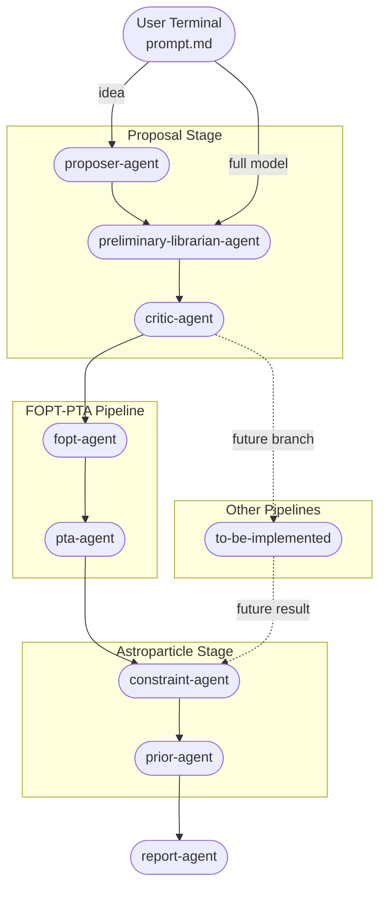

<div align="center">

# DarkAgents

**Towards an agentic system for theoretical astroparticle physics**

[](LICENSE.txt)
[](https://arxiv.org/abs/2606.00000)

</div>

We present **DarkAgents**: a multi-agent system that leverages the reasoning and code-generation capabilities of large language models (LLMs), together with deterministic tested human-written code, to build orchestrated pipelines for theoretical astroparticle physics research. 

While related approaches have been proposed in collider physics and cosmology, **DarkAgents** targets the specific challenges of this domain, such as model building, complex pipeline computations, multiple constraints and assumption auditing. 

The framework can be powered by different agentic command-line tools, including Mistral’s, Anthropic’s, OpenAI’s and local LLMs via Ollama. 

As first implementation, we apply **DarkAgents** to the study of cosmological first order transitions, starting from a classically scale-invariant particle-physics model and ending with the fit to the NANOGrav nanohertz gravitational-waves spectrum. 

**DarkAgent-PT** provides as output i) the best-fit values of model parameters, ii) their existing experimental and observational constraints, iii) an audit report of the assumptions and priors entering both i) and ii), of particular relevance for astroparticle physics. 

A companion pre-print is available on the arXiv: <a href="https://arxiv.org/abs/2606.00000">"2606.00000"</a>.

## Installation And Setup

The prerequisites to run **DarkAgents** are:
- Python 3.10+
- git and git-lfs (if downloading the repository with git)
- A command-line tool powered by a LLM, such as Anthropic's Claude Code, Mistral's Vibe, OpenAI's Codex or Ollama (for local LLMs).

Here we provide a step-by-step installation guide for MacOS.
### Step 1: Install prerequisites and download the repository
- Install Homebrew 
```bash
/bin/bash -c "$(curl -fsSL https://raw.githubusercontent.com/Homebrew/install/HEAD/install.sh)"
```
- Install Python 
```bash
brew install python
```
To download the repository using git:
- Install git and git-lfs (for large files), then enable git-lfs
```bash
brew install git
brew install git-lfs
git lfs install
```
- Clone the repository 
```bash
git clone https://github.com/PhysicsZandi/DarkAgents.git
cd DarkAgents
```
Otherwise, you can download the repository as a zip file from GitHub, extract it and navigate to the extracted folder.

### Step 2: Install the LLM CLI tool
Based on your choice of LLM, install the corresponding CLI tool. The installation of the CLI tool is a one-time operation. We report the command present in the official documentation:
- <a href="https://claude.com/product/claude-code">Anthropic's Claude Code</a>
  ```bash
  curl -fsSL https://claude.ai/install.sh | bash
  ```
- <a href="https://mistral.ai/it/products/vibe">Mistral's Vibe</a>
  ```bash
  curl -LsSf https://mistral.ai/vibe/install.sh | bash
  ```
- <a href="https://openai.com/it-IT/codex/">OpenAI's Codex</a>
  ```bash
  brew install node
  npm i -g @openai/codex
  ```
- <a href="https://ollama.com/">Ollama</a> (for local LLMs)
  ```bash
  curl -fsSL https://ollama.com/install.sh | sh
  ```

On its first launch, each CLI tools will prompt you to log in or provide an API key. Follow the instructions in the official documentation linked above. A subscription is required to run **DarkAgents** with non-local LLMs.

### Step 3: Run DarkAgents
Next, you need to build the workspace, move into the workspace and launch the CLI tool. The build script will convert the general instructions into the LLM-specific format that each CLI tool requires, producing a `<llm>_workspace/` folder. Here are the instructions for the supported LLMs:
- <a href="https://claude.com/product/claude-code">Anthropic's Claude Code</a>
  ```bash
  python build.py --llm claude
  cd claude_workspace
  claude
  ```
- <a href="https://mistral.ai/it/products/vibe">Mistral's Vibe</a>
  ```bash
  python build.py --llm vibe
  cd vibe_workspace
  vibe
  ```
- <a href="https://openai.com/it-IT/codex/">OpenAI's Codex</a>
  ```bash
  python build.py --llm codex
  cd codex_workspace
  codex
  ```
- <a href="https://ollama.com/">Ollama</a> (for local LLMs)
  ```bash
  python build.py --llm ollama
  cd ollama_workspace
  ollama launch claude --model <llm-name>
  ```
  
Inside the LLM workspace, you can write your prompt directly in the terminal, or in the `input/<model-name>/prompt.md` file and tell the terminal agent to use the prompt file as input.

## Examples

Example runs are available in the `examples/` folder, including the input prompt, the intermediate agent outputs and the final report.

Possible prompts to start the pipeline are, for instance:
```bash
What is the minimal conformal non-abelian model that can explain the NANOGrav signal?
```
or  
```bash
Can a classically scale-invariant $U(1)$ model with a dark scalar, a dark gauge boson and a dark fermion can explain the NANOGrav signal through a cosmological FOPT?
```


## Architecture

The current release of **DarkAgents** implements only the $\texttt{fopt-pta}$ branch. Future releases will include additional branches.



## Sub-agents and skills

The sub-agents and their skills implemented in the current release are listed in the table below. 

| Sub-agent | Skill | Purpose | Human-readable outputs |
| --- | --- | --- | --- |
| `proposer-agent` | `model-proposal` | Propose a backend-compatible locally novel BSM model when the input is not self-contained, but an idea. | `proposed_model.md` |
| `preliminary-librarian-agent` | `preliminary-literature-search` | Check novelty and extract literature benchmark hints. | `librarian_preliminary_report.md` |
| `critic-agent` | `model-critique` | Validate the model and flag physical inconsistencies. | `critique.md`, `model.md` |
| `fopt-agent` | `fopt-implementation` | Compute FOPT observables with the correct backend. Check PTA window based on dimensional analysis.| `fopt_report.md` |
| `pta-agent` | `pta-analysis`, `ptarcade-campaign` | Choose the appropriate spectrum template. Fit the FOPT GW spectrum to PTA data using visual PTA violins estimation and PTArcade campaign. | `pta_benchmark_report.md`, `ptarcade_report.md` |
| `constraint-agent` | `constraint-analysis` | Map the pipeline-preferred region to experimental constraints and find missing computations. | `constraint_report.md` |
| `prior-agent` | `prior-audit` | Audit any assumption, prior, approximation, uncertainty, validity domain, caveat, limitation or warning. | `prior_audit_report.md` |
| `report-agent` | — | Write the final LaTeX report. | `final_report.tex` |

## Citation 

To cite this work:
```bibtex
@article{
}
```

## Authors

- Michele Lucente (University of Bologna, INFN Bologna)
- Silvia Pascoli (University of Bologna, INFN Bologna)
- Filippo Sala (University of Bologna, INFN Bologna)
- Matteo Zandi (University of Bologna, INFN Bologna)

## License

**DarkAgents** is distributed under the GNU GPL v3.0 license. See [LICENSE.txt](LICENSE.txt) for more details.